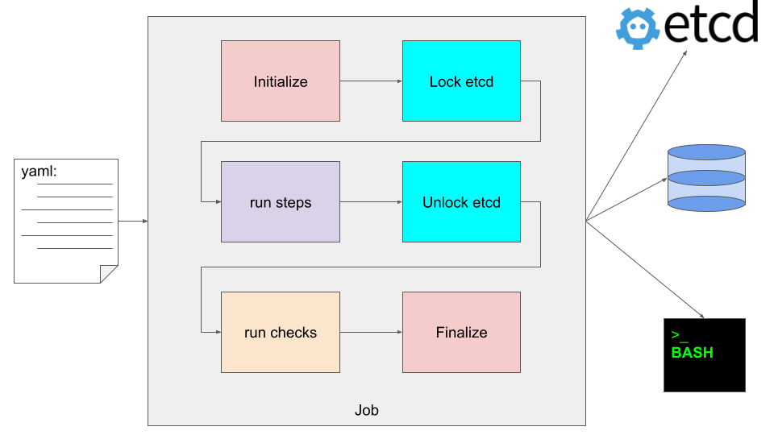
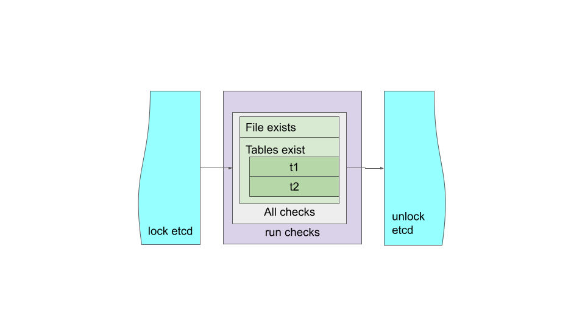

# Checks
PgQuartz is meant as a framework for easy job definition without the toil of technical implementation of underlying infrastructure, such as cluster wide coordination and parallelization.
This framework makes a clear distinction between the actual work ([Steps](./STEPS.md)), and quality assurance ([Checks](#checks)).

## Why this distinction
This approach adds the following benefits to teh PgQuartz framework:
- Results of [Steps](./STEPS.md) in basis don't have effect on each other; e.a. one stop failing does not block other steps
  - End result is done after running the [Steps](./STEPS.md)
  - During the [Steps](./STEPS.md) phase PgQuartz by default tries to finalize as much as possible without caring about failures in other steps ; This behaviour can be tuned by defining [when definitions](WHEN.md) as required.
  - **_note_** that [Commands](./COMMANDS.md) are serialized and failures do effect future [Commands](./COMMANDS.md)
- the Job developer is forced to make clear distinction between the work and QA which helps in proper definition and readability
- [Steps](./STEPS.md) can run in parallel without taking other steps into account
    - The [Steps](./STEPS.md) phase is about getting the work done as fast as possible
    - This even goes for Instances of Steps, everything can run in parallel as good as possible
- At QA time, we can look at result of steps without requiring to look at results of separate instances, 
  - We can still also look at results of a single instance if required, but the framework allows for inspection of combined results of all instances of a step
- This simplifies failure analysis
  - The failed Check is a clear direction to the actual failure 
  - Failed Checks can easily be found (always logged in the log tail)
- With this separation
  - PgQuartz enables functional testing (is the end state as expected) over technical testing (did the command raise an error)
  - PgQuartz test frequency is brought down significantly ; e.a. don't parse every output of every command for every instance of every step with grep, but simply do one check in the end of the job

## Configuration options

### Overlapping with [Commands](./COMMANDS.md)
The following options for [Commands](./COMMANDS.md) can also be set for Checks.
- Name
- BatchMode
- Inline / file
- Role
- Check type (See [Command type](./COMMANDS.md#Command types) for info on how it works)

### Specifying arguments on checks
Similar by defining [Steps](./STEPS.md), a Check can also be defined with a matrix of arguments.
The implementation is very similar to [Step instances](./INSTANCES.md), with a few distinctions:
- We don't call them separate Instances, since they are run in series, and one failure halts the rest of the current Check and all future Checks.
- For [Steps and Instances](./INSTANCES.md), a matrix of arguments is applicable to all [Commands](./COMMANDS.md) in a [Step](./STEPS.md), but Checks don't have that extra dimension. A Matrix of arguments is only applicable to one Check and every Check can have its own definition.

###	Rc
Rc configures the expected Return Code for a check. This defaults to 0 (success return code).
If a check is run and does not return the expected return code, the command is expected to have failed.

###	Expected
An `expected string` can be configured. When set, PgQuartz searches stdout of the check for this `expected string` and when not found, the command is expected to have failed.
Consider this as an alternate to running a command and then grepping its output for `SUCCESS` to see if it succeeded.

###	Unexpected
An `unexpected string` can be configured. When set, PgQuartz searches stdout of the check for this `unexpected string` and when it is found, the command is expected to have failed.
Consider this as an alternate to running a command and then grepping its output for `FAIL` to see if it failed.

## How and when are Checks run

### When is the check block run

As can be seen in the above diagram, PgQuartz first runs [Steps](./STEPS.md) and then runs Checks.
Furthermore, [Steps](./STEPS.md) are run inside an [etcd](./ETCD.md) context (blocking same jobs on other servers), where Checks are not.

### When are checks run

As can be seen in the above diagram, PgQuartz basically runs all Checks as one block comparable to how it runs all [Commands](./COMMANDS.md) for one [Step](./STEPS.md): 
- all Checks are run as one big block
- all Checks run in series (one runner, no parallelization)
- if a Check fails, it is reported, and PgQuartz exits with an error exit code

## Example
We make the 'Checks concept' a bit more tangible with an example:

### Example config
```
steps:
  step 1:
    commands:
      - name: Run command 1.1
        type: pg
        inline: |
          CREATE TABLE IF NOT EXISTS t1 (id int, txt text);
          CREATE TABLE IF NOT EXISTS t2 (id int, id2 int);
      - name: Run command 1.2
        type: shell
        inline: "echo 'Done that' > /tmp/beenhere.txt"
checks:
  - name: File exists
    type: shell
    inline: test -f /tmp/beenhere.txt
    rc: 1
  - name: Tables exist
    type: pg
    inline: "select * from pg_tables where schemaname='public' and tablename = :tblname"
    matrix:
      tblname:
        - t1
        - t2
```

## Graphical representation


### What does it do?
When running a job with a specification as shown in the [example](#example-config), PgQuartz will do the following:
1. PgQuartz will lock etcd, run the steps (in parallel), and unlock etcd
   - **_note_** that PgQuartz does not exit on Step errors
2. After that, PgQuartz will run the checks in the following order:
   - File exists
     - if it does not result as expected, log error end exit with error exit code (1)
   - Tables exist (t1)
     - if it does not result as expected, log error end exit with error exit code (1)
   - Tables exist (t2)
     - if it does not result as expected, log error end exit with error exit code (1)
3. If all checks resulted as expected:
   - Report 'Job finished successfully'
   - Exit with success exit code