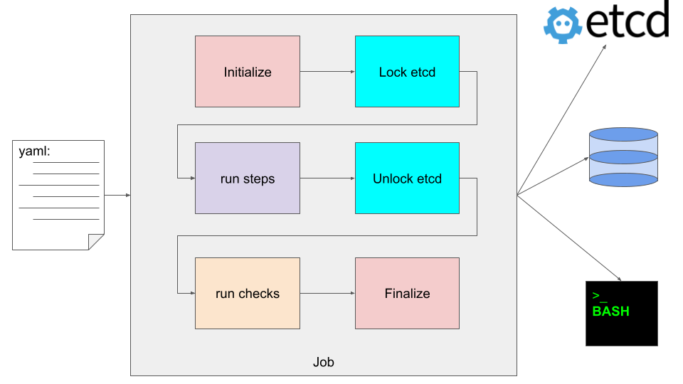

# PgQuartz jobs

Jobs are the highest level of configuration within PgQuartz.
When you run PgQuartz, you pass it a configuration file and all configuration in that file might be defined as 'the job'.

Jobs basically consist of:
- [Steps](./STEPS.md), [instances](./INSTANCES.md) and [commands](./COMMANDS.md)
- [checks](./CHECKS.md)
- connection config
   - [PostgreSQL connections](./CONNECTIONS.md)
   - [etcd](./ETCD.md)
- Generic config (laid out below)

## Graphical representation


## Generic job config chapters
The following configuration can be set at the top level:

### debug
Be more verbose. Debug mode can also be enabled at commandline with the -d argument

### git
If PgQuartz detects that the job is defined in a git repository, PgQuartz will pull the latest version and reload the config before running the job.
In the git chapter some config can be configured to control this git pull behaviour.
The following options can be defined:
- remote: The remote to pull from. Defaults to `origin`.
- rsaPath: The rsa private key to use when pulling from an ssh remote
- httpUser / httpPassword: The user / password to use when pulling from a http(s) remote. Can also be set as part of the remote url.
- disable: Disable the pull feature

### logFile
PgQuartz logs errors to stderr and other messages to stdout.
By setting a logFile, PgQuartz additionally writes logging to the destination file.
If logFile points to a directory, PgQuartz creates a file in that directory with a predefined filename consisting of the current date, and the job name.
**_note_** that the job name is derived from the yaml that defines the job (e.a. `/etc/pgquartz/jobs/job1.yaml` would result in a job name `job1`)

### parallel
PgQuartz has implemented parallelism with regard to:
- runs multiple instances of a step in parallel (see [instances](INSTANCES.md) for more info).
- runs multiple steps in parallel when it can (see [steps configuration](STEPS.md#Dependencies) for more info)
The parallel setting configures the number of runners which defines the number of parallel tasks run by PgQuartz

### runOnRoleError
Connections can be defined with a role.
When the configured (expected) role does not match the actual role, PgQuartz exits with an error.
By setting `runOnRoleError=true`, PgQuartz continues processing, and skips commands against a connection with unexpected role.

### timeout
Connection operations, like locking in etcd and running PostgreSQL queries run within a context.
The timeout parameter times out this context and as such acts as a generic timeout for the entire job.
When the timeout exceeds all running operations are cancelled and PgQuartz quits with an error message and error exit code.

### workdir
The workdir from where all scripts are loaded. This parameter defaults to the location of the job definition file and can usually be left out.

## Example config
```
debug: true
git:
  remote: origin
  rsaPath: ~/.ssh/id_rsa
  httpUser: memyselfandi
  httpPassword: secret
  disable: false
logFile: /var/log/pgquartz/pgquartz.log
parallel: 2
runOnRoleError: true
timeout: 1h
workdir: /etc/pgquartz/jobs/job1/

# steps need to be configured. Please see https://github.com/MannemSolutions/PgQuartz/docs/STEPS.md for more information on the definition
steps: {}
# checks should be configured. Please see https://github.com/MannemSolutions/PgQuartz/docs/CHECKS.md for more information on the definition
checks: []
# connections should be configured. Please see https://github.com/MannemSolutions/PgQuartz/docs/CONNECTIONS.md) for more information on the definition
connections: {}
```
