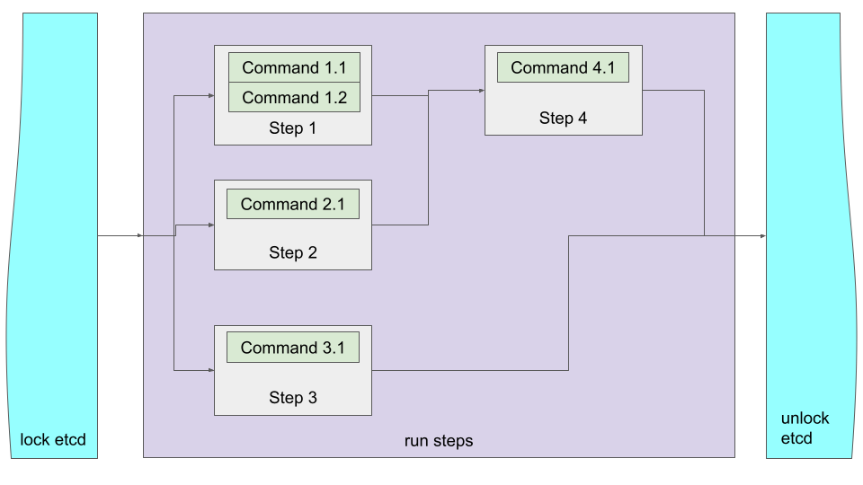

# Steps
Steps are the basic building blocks out of which [Jobs](./JOBS.md) are defined.

## Some facts about Steps
- Steps are the building basic building blocks at the center of the PgQuartz solution.
- When processing a [job](./JOBS.md) PgQuartz will first run all Steps (the actual work at hand), and then run [Checks](./CHECKS.md) to verify results.
- Steps are built out of [Commands](./COMMANDS.md) which are run in order until one of them fails.
   - When a Command fails, that Step stops processing [Commands](./COMMANDS.md) and enters a failed state
   - Steps entering a failed state does not impact other Steps and/or [Checks](./CHECKS.md) unless you configure it so.
- Steps are all run in parallel unless dependencies between steps are configured
- Steps can be run multiple times with different arguments by specifying a [matrix](./INSTANCES.md) of all arguments
   - Every combination of arguments is labelled a Step Instance
   - All instances of a step are run in parallel as well

This boils down to a PgQuartz [job](./JOBS.md) definition where everything that can be run in parallel is defined as separate steps, or ([matrix](./INSTANCES.md)) arguments on a step.

## Configuration options

### Dependencies
Although steps by default are independent units scheduled to be run in parallel, dependencies between steps can be configured with a dependency setting.
When dependencies are configured, the step will not be scheduled before dependencies have been run and finished first.

> **Note** that dependencies are not automatically added for When resolution. All steps referenced in When rules should be added as manual dependencies as well. See #42 for more information.

### When
Next to dependencies (wait for other step to finish) we can also configure checks on results of other jobs.
We can them when-rules, and they should be configured in the `when:` argument of the step whom should check before running.
If one or more rules don't check out to be successful, the step is not scheduled, but moves to `Done` state directly.
For more information, please refer to [when](./WHEN.md)

## Example
We make the 'Steps concept' more tangible with an example:

### Example config
```
steps:
  step 1:
    commands:
      - name: Run command 1.1
        type: pg
        file: ./sql/step_1.1.sql
      - name: Run command 1.2
        type: shell
        file: ./bash/step_1.2.sh
  step 2:
    commands:
      - name: Run command 2.1
        type: pg
        file: ./sql/step_2.1.sql
  step 3:
    commands:
      - name: Run command 3.1
        type: shell
        file: ./bash/step_3.1.sh
  step 4:
    commands:
      - name: Run command 4.1
        type: pg
        file: ./sql/step_4.1.sql
    depends:
      - step 1
      - step 2
    when:
      - "eq .Steps["step 1"].Instances.Rc 0"
      - '.Steps.["step 2"].Instances.StdOut.Contains "{oid}={13694}"'
parallel: 2
```

## Graphical representation


### What does it do?
When running a job with a specification as shown in the [example](#example-config), PgQuartz will do the following:
1. PgQuartz will create a work queue and add `step 1`, `step 2` and `step 3` to that queue. 
   - `step 4` needs to wait for its dependencies to resolve.
2. PgQuartz will create 2 Runners due to `parallel: 2`.
   - Both Runners start processing a step (either `step 1`, `step 2` or `step 3`).
   - the third step (which could be any of the three) needs to wait until a runner is finished processing its current step
3. Should command 1.1 fail (see [commands](./COMMANDS.md) on what can make a command enter failed state), command 1.2 is never run.
4. Once `step 1` and `step 2` are done, `step 4` will be added to the queue, but only if the `when` part works out
   - `step 1` must finish with a return code 0
   - `step 2` requires output that contains a string "{oid}={13694}"
   - If either (or both) is not the case, then the job enters the done state without being queued.
   - See [when](./WHEN.md) for more details
