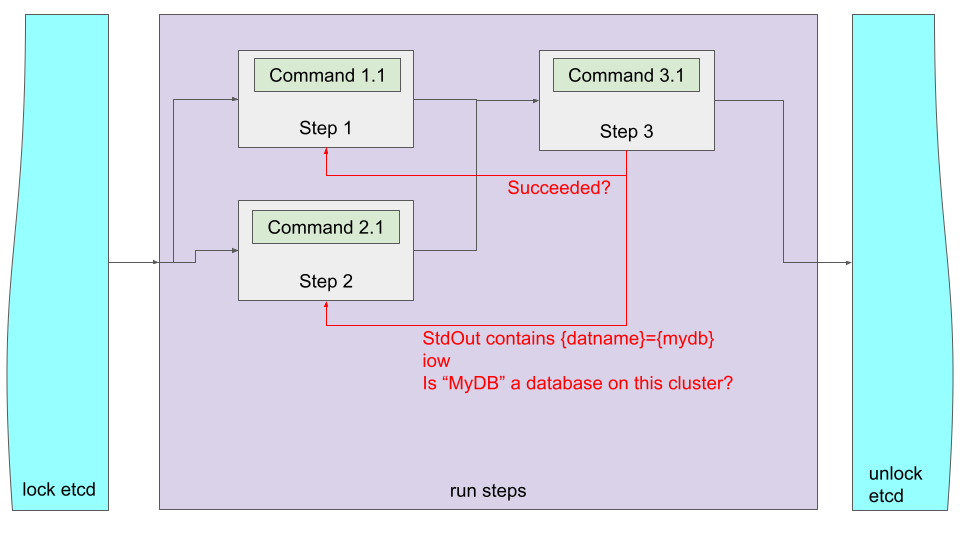

# When
When is an option to [steps](./STEPS.md) which defines rules for jobs to run.
The rules are checked against output and result codes of previous [job steps](./STEPS.md).

## Some facts about the `when` statement
`When` statements are:
- the most complex parts of job definitions.
- configured at the [step](./STEPS.md) level
- checks against results of other steps
- decisions that define if a [step](./STEPS.md) should be run
- defined as [go templates](https://pkg.go.dev/text/template)

## Special methods
PgQuartz has implementations of special methods to be used as part of the `when` statements:

### Rc
PgQuartz keeps track of all Return Codes of all commands and has a special method to collect the return codes of all commands.
the method is called `Rc` and is implemented on Steps, Instances, and Commands, where:
- Step.RC returns the sum of all Rc values of all instances
- Instance.Rc returns the sum of all Rc values of all Commands
- Command.Rc:
  - shell: Is set to the return code of the execution
  - postgresql: Is set to 0 on success, is set to 1 of failure

> **_Note_** that Rc is implemented as an integer, which means that it could overflow but only with more than 16843009 commands ending in exit code 255, or even more with lower exit codes, which probably is not a realistic use case.

### StdOut and StdErr
PgQuartz keeps track of all output of all Commands, and has a special method to collect the return codes of all commands.
the method is called `Rc` and is implemented on Steps, Instances, and Commands, where:
- Step.StdOut returns a concatination all StdOut values of all instances ; similar for StdErr
- Instance.StdOut concatination all StdOut values of all Commands ; similar for StdErr
- for shell scripts, StdOut contains the stdOut of the execution and StdErr (as expected) contains the stdErr of the execution
- for postgresql queries, StdOut contains a special formatted output of the table where
  - every row ends on a new line
  - every line is compiled version of {name}={value} where name is the columns name and value is the column value (with ' replaced by '' for values)
- for postgresql queries, StdErr is empty

> **_Note_** Internally PgQuartz works with a special type Result, which are meant for efficient handling of concatination of stdout and stdErr.
> But the less output (rows or lines) the better, so make sure as a developer that Commands produce as little output as required.

### StdOut and StdErr

## Example
We make the 'When concept' more tangible with an example:

### Example config
```
steps:
  step 1:
    commands:
      - name: Check if /etc/fstab exists
        type: shell
        inline: test -x /etc/fstab
  step 2:
    commands:
      - name: Run command 2.1
        type: pg
        inline: select datname from pg_database
  step 3:
    commands:
      - name: Run command 3.1
        type: pg
        file: ./sql/step_3.1.sql
    depends:
      - step 1
      - step 2
    when:
      - "eq .Steps["step 1"].Instances.Rc 0"
      - '.Steps.["step 2"].Instances.StdOut.Contains "{datname}={mydb}"'
parallel: 2
```

## Graphical representation


### What does it do?
When running a job with a specification as shown in the [example](#example-config), PgQuartz will do the following:
1. PgQuartz will create a work queue and add `step 1`, and `step 2` to that queue.
    - `step 3` needs to wait for its dependencies to resolve.
2. PgQuartz will create 2 Runners (due to `parallel: 2`).
    - Both Runners start processing a step (both `step 1` and `step 2` are processed).
3. Should command 1.1 fail (see [commands](./COMMANDS.md) on what can make a command enter failed state):
   - RC of `step 1` would not be 0
   - the first `when` statement on `step 3` will prevent `step 3` from running
4. Should command 2.1 fail, or not find any database `mydb`:
   - the stdout will not contain `{datname}={mydb}`
   - the second `when` statement on `step 3` will prevent `step 3` from running

**_note_** that `step 3` also has dependencies on `step 1` and `step 2`.
These are currently required because without them:
- `step 3` would be scheduled before `step 1` and `step 2` would have been running
- at schedule time, `step 1` would not have an RC set. RC defaults to 0, so `step 3` would still be scheduled regardless of failure of step 1.
- at schedule time `step3` would not have a stdout set. StdOut defaults to empty string, which does not contain `{datname}={mydb}` so step 3 would not be run, even if `mydb` would exist
- `step 3` would not be run (prevented by second when statement 'always failing' without dependencies)
